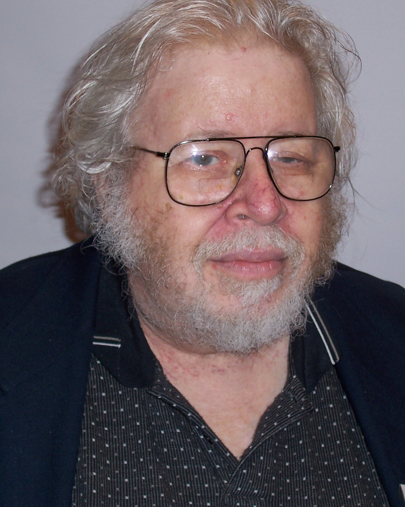

<h1>shuster</h1>

  This is a mirror of the late Prof. Malcolm D. Shuster’s <a href="https://www.malcolmdshuster.com">website</a>, created with the intention of preserving access to his work in case the original site becomes unavailable.

  The mirror was generated using HTTrack Website Copier (httrack_x64-3.49.2) and I do not claim ownership of any of the material.

<h2>Commentary</h2>

  
   Prof. Malcolm D. Shuster  

  I first found out about Prof. Shuster, his work, and his website back in 2020 while working on my Bachelor's thesis on Attitude Determination and Control Systems (ADCS) of satellites. Specifically, I was researching his renowned QUEST algorithm. But what I discovered went far beyond just the algorithm itself — I was treated to a trove of insightful, often candid, and deeply personal reflections through his informal writings, which felt like an insider's perspective into the field.

  I enjoy his lucid and elegant writing style, his willingness to challenge and defend ideas, and his thoughtful inclusion of ancient quotations, which add a unique philosophical flavor to his technical discussions. His passion for both the art and science of estimation is as inspiring as it is infectious.

  I think I'll refrain from saying more and simply encourage you to explore his work for yourself. But before I do, allow me to share an excerpt from his 2006 paper <i>In My Estimation</i>:

  <blockquote>
    <i><q>
      My table is simplistic, to be sure. Newton, Kepler, and Euler certainly had their antecedents, and the development of Mechanics by Newton was the culmination of a long and continuous process. Most striking, however, is that while three of the quadrants are populated by several intellectual giants of old and can boast of 250 or more years of development, the south-east quadrant is sadly deserted. There were, apparently, no eighteenth- or nineteenth-century contributors to attitude estimation of even modest calibre. In May 1977, when I formally entered the Astronautics community, there was one lone young university professor, John Junkins, who had just begun to publish some work on attitude estimation, but the field would not become his focus.
    </q></i>
  </blockquote>

  <table border="1" style="border-collapse: collapse;">
    <tr>
      <th></th>
      <th>Dynamics</th>
      <th>Estimation</th>
    </tr>
    <tr>
      <td><strong>Orbit</strong></td>
      <td>Newton (1642–1727)  Lagrange (1736–1813)  Hamilton (1805–1865)  Einstein (1874–1955)</td>
      <td>Kepler (1571–1630)  Lagrange (1736–1813)  Gauss (1777–1855)</td>
    </tr>
    <tr>
      <td><strong>Attitude</strong></td>
      <td>Euler (1707–1783)  Cayley (1821–1895)</td>
      <td>(gone fishin’)</td>
    </tr>
  </table>
  Table. Founders of Astronautics

